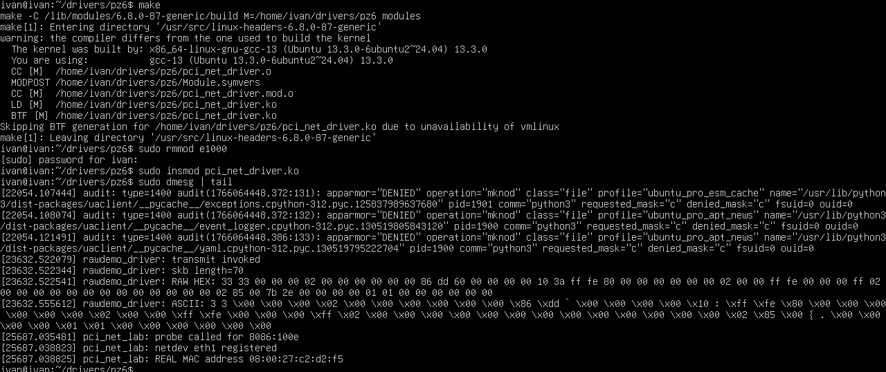

Написать PCI драйвер с probe и release для сетевого адаптера.
Вставить в probe инициализацию сетевого драйвера с предидущего занятия.
Реализовать чтение MAC адреса
# Сборка make
```
make -C /lib/modules/6.8.0-87-generic/build M=/home/ivan/drivers/pz6 modules
make[1]: Entering directory '/usr/src/linux-headers-6.8.0-87-generic'
warning: the compiler differs from the one used to build the kernel
  The kernel was built by: x86_64-linux-gnu-gcc-13 (Ubuntu 13.3.0-6ubuntu2~24.04) 13.3.0
  You are using:           gcc-13 (Ubuntu 13.3.0-6ubuntu2~24.04) 13.3.0
make[1]: Leaving directory '/usr/src/linux-headers-6.8.0-87-generic'
```

# Отключение физического драйвера
```
ivan@ivan:~/drivers/pz6$ sudo rmmod e1000
```
# Вставка модуля
```
ivan@ivan:~/drivers/pz6$ sudo insmod pci_net_driver.ko
ivan@ivan:~/drivers/pz6$ sudo dmesg | tail -n 20
```



# Выгрузка модуля
```
ivan@ivan:~/drivers/pz6$ sudo rmmod pci_net_driver
ivan@ivan:~/drivers/pz6$ sudo modprobe e1000
```