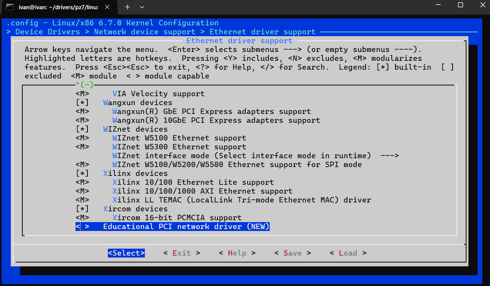

# Задание

## Подгтовка исходников ядра
```
# Переходим в репозиторий с исходниками
cd ~/drivers/pz7/linux

# Переключаемся на нужную версию ядра
git checkout v6.7
```

## Создание каталога драйвера
```
# Переходим в каталог сетевых драйверов
cd drivers/net/ethernet

# Создаём каталог для нашего драйвера
mkdir pci_net_lab
cd pci_net_lab
```

## Интеграция драйвера в дерево ядра
```
# Редактируем Makefile каталога ethernet
obj-$(CONFIG_PCI_NET_LAB) += pci_net_lab.o

# Редактируем Kconfig каталога ethernet
config PCI_NET_LAB
    tristate "Educational PCI network driver"
    help
      This is a sample PCI network driver for lab purposes.

# Добавляем в общий Kconfig драйверов ethernet
source "drivers/net/ethernet/pci_net_lab/Kconfig"
```

## Настройка конфигурации ядра через menuconfig
```
# Устанавливаем зависимости для menuconfig
sudo apt install flex bison libncurses-dev

# Запускаем меню конфигурации
make menuconfig (Device drivers -> Network device support -> Ethernet -> Ethernet driver support)
```



## Создание git патча

```
# Проверяем изменения
git status

# Добавляем файлы драйвера и изменения Makefile/Kconfig
git add drivers/net/ethernet/pci_net_lab
git add drivers/net/ethernet/Makefile
git add drivers/net/ethernet/Kconfig

# Делаем коммит
git commit -m "net: add educational PCI network driver"

# Генерируем патч
git format-patch -1 HEAD

# Появится файл:
# 0001-net-add-educational-PCI-network-driver.patch
```